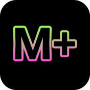

# MuseumPlus for CraftCMS plugin for Craft CMS 4.x

Allows to import MuseumsPlus Collection data to Craft CMS and publish data.



## Requirements

This plugin requires Craft CMS 4.7 or later and php 8.1 or later.

## Installation

To install the plugin, follow these instructions.

1. Open your terminal and go to your Craft project:

        cd /path/to/project

2. Then tell Composer to load the plugin:

        composer require furbo/museum-plus-for-craft-cms

3. In the Control Panel, go to Settings → Plugins and click the “Install” button for MuseumPlus for CraftCMS.

## Overview

MuseumPlus for CraftCMS automatically imports items from one or more collections and makes them available to Craft.

### Features
- Import M+ Data From Craft
- Import Assets like mages or other files to a Craft File System
- Use Craft Transforms to generate thumnails etc
- Add additional fields to items
- Show item details or filtered lists (filter by vocabulary, people, ...)
- Include items in craft fulltext search
- Automatically enrich data from AI (Google Gemini).

## Configuration

Once the plugin is installed, you can configure it in the Craft Control Panel under Settings → MuseumPlus for CraftCMS.
You will need to provide:
- the MuseumPlus classifier
- the hostname for the MuseumPlus API
- the MuseumPlus API username
- the MuseumPlus API password

After saving the settings you will see the list of collections you have access to: choose at least one collection and save the settings.
You should also choose the filesystem where the media will be stored: note that the two subfolders `Items` and `Multimedia` will be automatically created in the root of the filesystem.
You can specify which kind of files to import: the plugin will download the files and store them in the chosen filesystem.
In the settings there is a section to define the URI format and template to be used to show collection items in the frontend.

The shell command `./craft museum-plus-for-craft-cms/collection/update-items` will import the data from the selected collections.
We advise to set up a cron job to run this command regularly.

## Usage

In the backend you will see a new section called "Collection" where you can see the imported collections and their items

Frontend example to display the items:
```


    <h2>{{ item.title }}</h2>
    <p>{{ item.description }}</p>
    

```

Frontend example to display a list of items filtered by vocabuilary ref:
```



    <h2>{{ item.title }}</h2>
    <p>{{ item.description }}</p>
    


```

Frontend example to display a single item:
```



    
    

<h2>{{ item.title }}</h2>
```

Other methods available in twig:
```
craft.museumPlus.getItemById(id)
craft.museumPlus.getItemsByIds(ids)
craft.museumPlus.getVocabularies($type)
craft.museumPlus.getVocabularyById(id)
craft.museumPlus.getAllPeople()
craft.museumPlus.getPeopleById(id)
craft.museumPlus.getObjectGroupById(id)
craft.museumPlus.getAllObjectGroups()
craft.museumPlus.searchItems(params)
```

Methods available in on a item:
```
 - getAttachment // gets the main image / file
 - getMultimedia // gets other images / files
 - getObjectGroups // dito
 - getLiterature // dito
 - getOwnerships // dito
 - getAssociationPeople // dito
 - getOwnerPeople // dito
 - getAdministrationPeople // dito
 - getRelatedItems // gets the items related to this object
 - getVocabularyEntries // gets the vocabulary entries related to this item
 - getVocabularyEntriesByType(type) // gets the vocabulary entries related to this item filtered by type
```

Methods available in on a vocabulary entry:
```
getItems() // gets all ietms associted by this type
getParent() // get the parent vocabulary node
getParents() // get all parents up the tree
getPath() // get all parents up the tree plu sthe node itself
```

The getRecords methods gives acces to the underlying record element.
Here the methods that can be called on the records (items, people, objectgroups, vocabulary entries, literature, ownerships)
```
getRepeatableGroupValues(groupName, attribute = null, filterTypes = [])
getDataAttributes() (for all)
getDataAttribute(name)
```


### Events

The plugin throws a custom event after an item has been updated or created by the plugin.Custom modules can then listen to the event and add some custom functionality.

Add this code to the init() method of your custom module in craft cms.

```
Event::on(
    MuseumPlusForCraftCms::class,
    MuseumPlusForCraftCms::EVENT_ITEM_UPDATED_FROM_MUSEUM_PLUS,
    function(ItemUpdatedFromMuseumPlusEvent $e) {
        //Example: lets say you have an extra field, for example is_new to show alle the newly created items in a collection.
        //The field can the be removed manually from the backend
        $item = $e->item;
        if ($e->isNewItem) {
          $item->is_new = true;
          Craft::$app->elements->saveElement($item);
        }
    }
);

```

## Roadmap

* Integrate Google Gemini for better titles and descriptions

Brought to you by [Furbo GmbH](https://furbo.ch)
